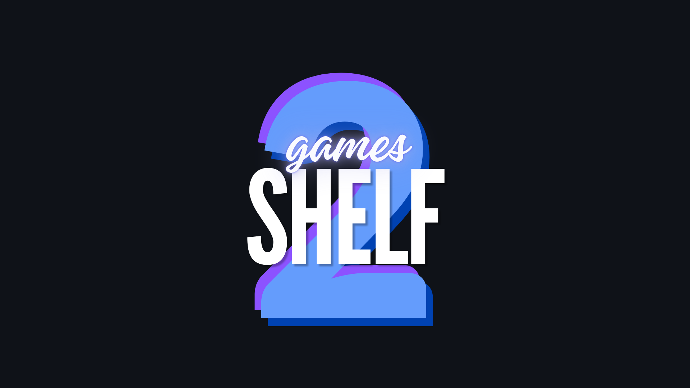

# Games2Shelf

***Una plataforma para el seguimiento de videojuegos — ¡Cataloga tu biblioteca, sigue tu progreso, crea listas de deseos, escribe reseñas y comparte tu trayectoria como jugador!***

 
 

## Repositorios

<table width="100%">
<tr>

<td width="220" align="center" valign="middle">
  
</td>

<td valign="top">

### [Backend](https://github.com/games2shelf/backend)

Desarrollo del servidor — Django REST API.

  
  
  
  
  
  
  

</td>

<td width="200" valign="center">

 
 

</td>

<tr>

<td width="220" align="center" valign="middle">
  
</td>

<td valign="top">

### [Frontend](https://github.com/games2shelf/frontend)

Desarrollo del cliente — React SPA.

  
  
  
  

</td>

<td width="200" valign="center">

 
 

</td>

</tr>
</table>
